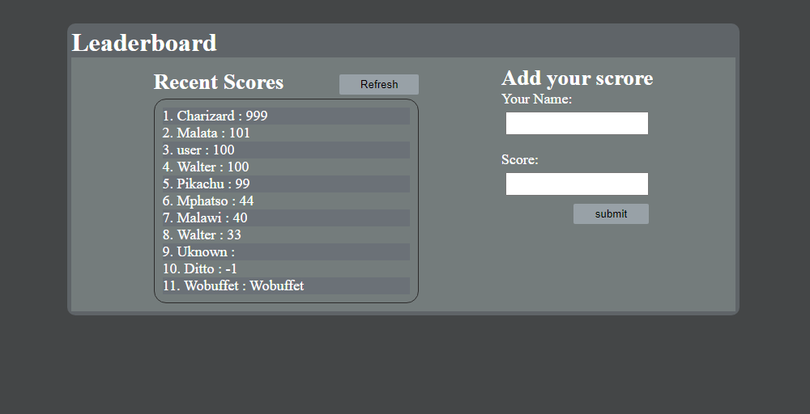

# Project Name

> Leaderboard.

This is a project to demonstrate the use of JavaScript with API by creating the leaderboard.

## Built With

- HTML
- CSS
- Javascript
- Webpack
## Live Demo

[Live Demo Link](https://lichapa-leaderboard.netlify.app/)

## Author

@Lichapa: Mphatso Lichapa

- GitHub: [@Lichapa](https://github.com/Lichapa)
- Twitter: [@LichapaMphatso](https://twitter.com/LichapaMphatso)
- LinkedIn: [mphatsolichapa](https://www.linkedin.com/in/mphatsolichapa)

## 🤝 Contributing

Contributions, issues, and feature requests are welcome!

Feel free to check the [issues page](../../issues/).

## Show your support

Give a ⭐️ if you like this project!

## Acknowledgments

- Microverse

## 📝 License

This project is [MIT](https://mit-license.org/) licensed.